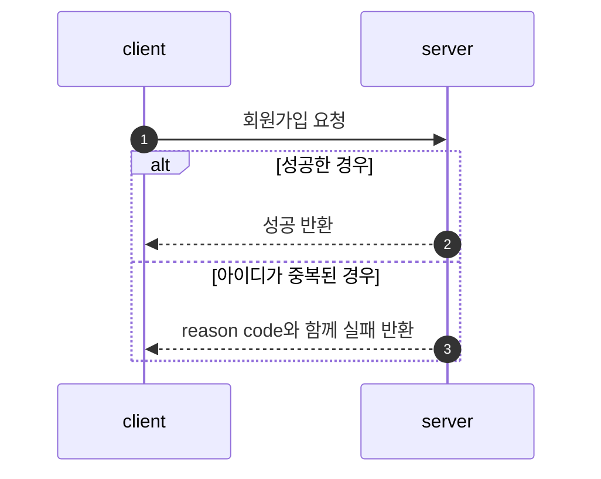
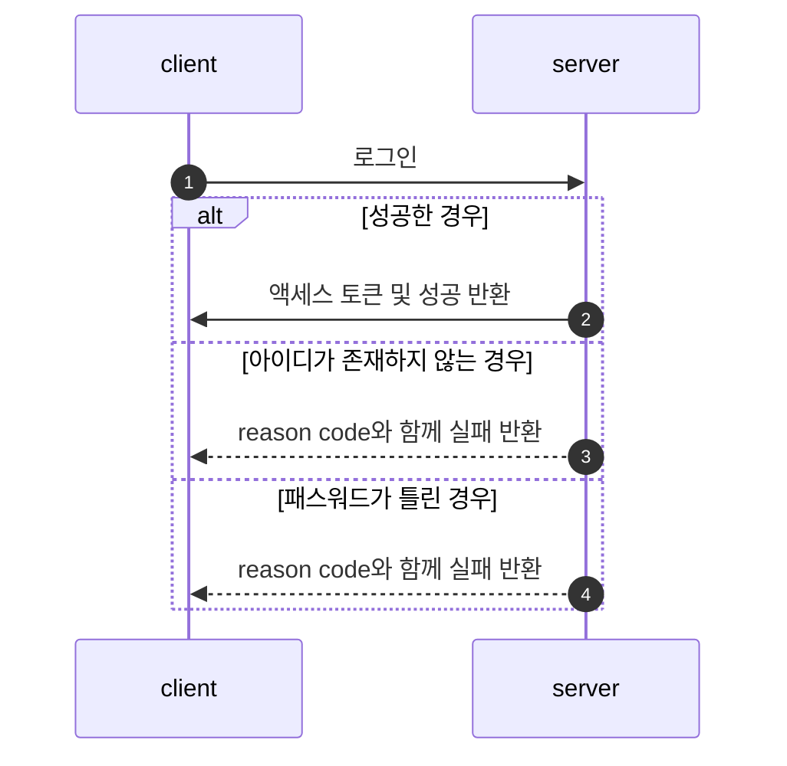
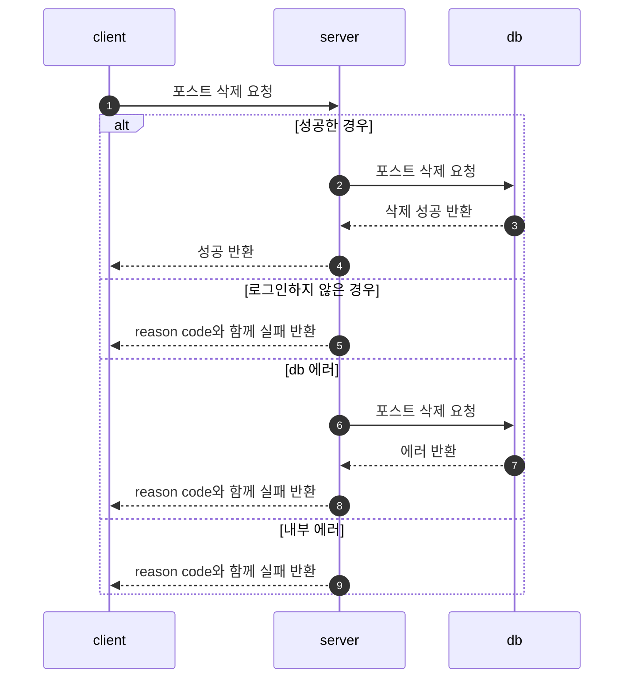
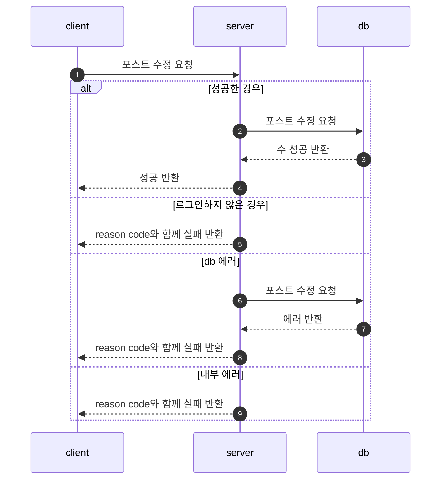
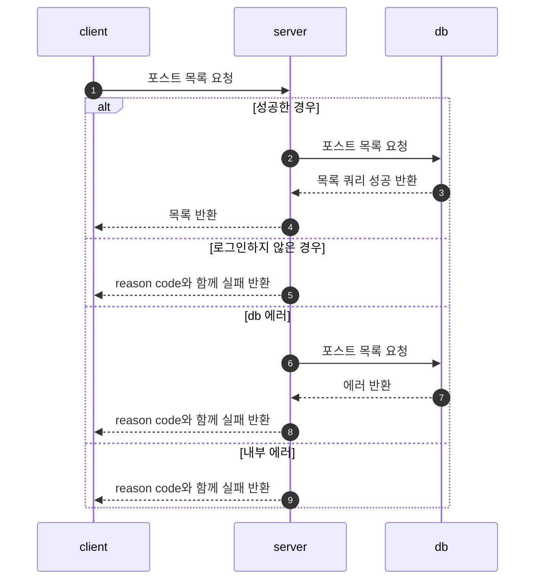
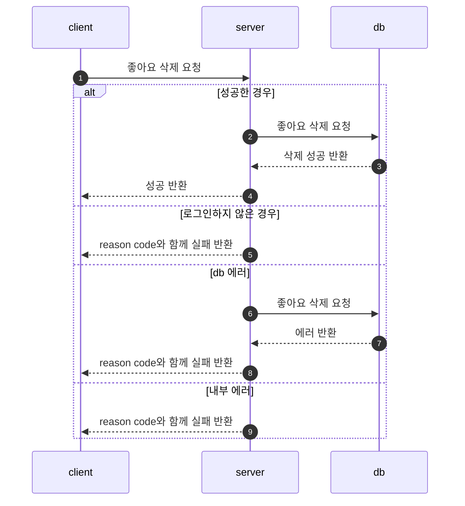

# Board Project
가장 기본 적이고 보편적인 게시판 기능을 둘러볼 수 있는 서비스입니다.  
멀티 모듈 을 사용하여 프로젝트를 구성하였습니다.  
Spring Boot와 React를 사용하여 구현하였습니다.  
무중단 배포 환경을 구축하였습니다.    

##  [프로젝트 링크](http://ec2-52-78-125-101.ap-northeast-2.compute.amazonaws.com/)

## 개발 환경

* Intellij IDEA Ultimate 2023.1.1
* Java 17
* Gradle 8.3
* Spring Boot 3.1.3
* node 21.1.0

## 기술 세부 스택

Spring Boot

* Spring Web
* Spring Data JPA
* Spring Security
* Spring Validation
* Spring Actuator
* Lombok
* Spring Configuration Processor
* MySQL Driver
* JJWT

Test

* H2 Database
* Spring Rest Docs
* Rest Assured
* Guava
* Spring MockMvc
* JUnit 5

Server & Database

* AWS EC2
* Nginx
* AWS RDS

React 
* npm install react-router-dom@6 
* npm install bootstrap 
* npm install redux react-redux redux-promise redux-thunk

CI/CD
* Github Actions

## CI / CD Flow

1. 기능 개발이 완료가 되면 main 브랜치로 push를 한다.
2. Github Actions에서 테스트를 포함한 빌드가 수행된다.
3. Jacoco가 최소 테스트 커버리지를 만족하는지 검사한다.
4. 소나 큐브가 정적 코드 분석을 한다.
6. ssh로 원격 서버에 접속한다.
7. 배포 쉘 스크립트를 실행한다.
8. 배포된 서버의 상태를 슬랙으로 알림을 보낸다.

### [무중단 배포 블로그 작성 글](https://techjisu.tistory.com/176)

## Flow Chart

1. 회원가입

2. 로그인

3. 포스트 작성

4. 포스트 삭제

5. 포스트 수정

6. 포스트 목록

7. 좋아요 추가

7. 좋아요 삭제

